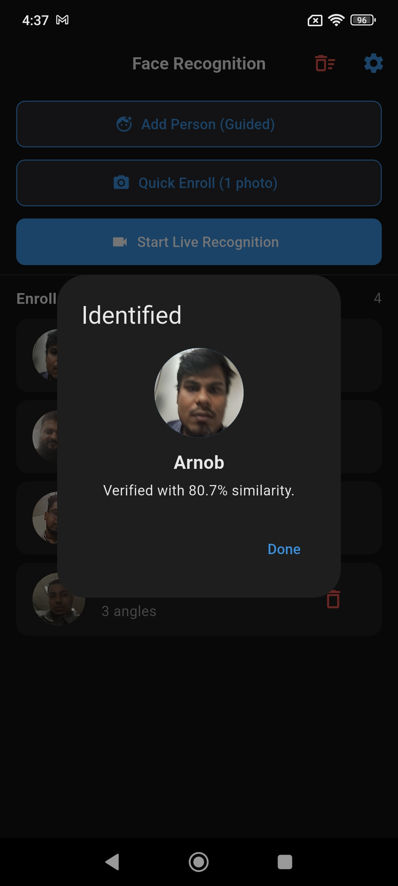
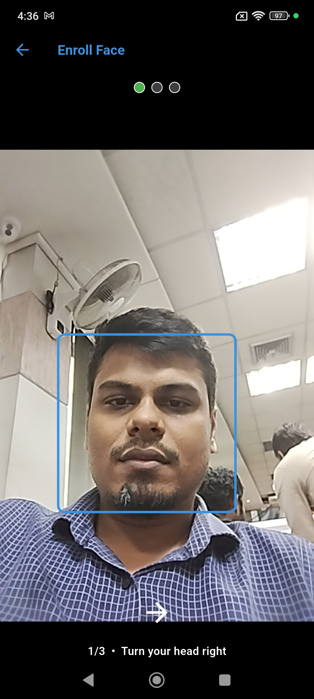
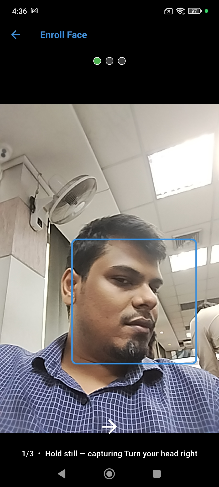
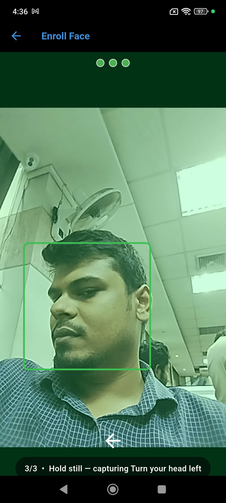
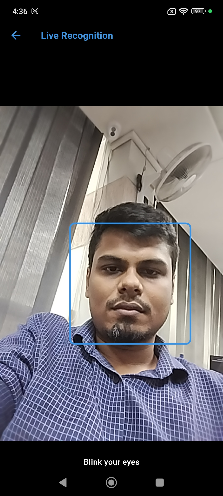
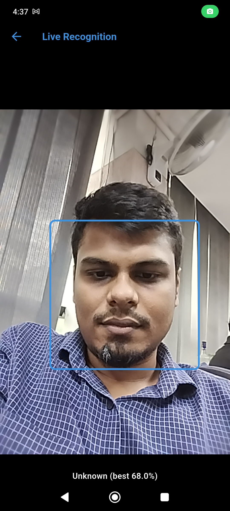

# face_recognition_engine

**On-device face recognition for Flutter.** MobileFaceNet embeddings, cosine
matching, guided multi-angle enrollment, liveness / anti-spoofing and
ready-made camera screens — all running locally. No server, no network call, no
face data leaving the device.

[](https://pub.dev/packages/face_recognition_engine)
[](https://pub.dev/packages/face_recognition_engine/score)
[](https://pub.dev/packages/face_recognition_engine/score)
[](LICENSE)

Two calls do the heavy lifting:

```dart
final enrolled = await FaceRecognitionKit.enroll(context, modelAsset: model);
final match    = await FaceRecognitionKit.detect(context,
                       candidates: people, modelAsset: model);
```

---

## Screenshots

The enrollment and live-recognition screens below are what `enroll()` and
`detect()` open for you. The first shot — the enrolled-people list and the
"Identified" dialog — is host-app UI built *around* those two calls: the package
hands back a `DetectionResult` and leaves the presentation to you. (The bundled
[`example/`](example/lib/main.dart) app is deliberately smaller than this.)

| Identified | Guided enrollment | Capturing a pose |
| --- | --- | --- |
|  |  |  |

| Final angle | Liveness challenge | Unknown face |
| --- | --- | --- |
|  |  |  |

## Features

| | |
| --- | --- |
| 📸 **Ready-made camera screens** | Guided multi-angle enrollment + live recognition, behind two function calls. |
| 🧠 **Bring your own model** | Load any MobileFaceNet `.tflite` (112×112 → 192-d) from an asset or `Uint8List`. Nothing heavy bundled. |
| 🛡️ **Liveness & anti-spoofing** | Blink / head-turn / smile challenges, optionally randomized, plus a passive texture `SpoofDetector` (BYO model). |
| 👥 **Multi-angle enrollment** | Several templates per person; optional file-backed persistence via `FaceProfileStore`. |
| 🔍 **1:N identification** | Match a probe against every enrolled person by best cosine similarity. |
| ⚙️ **One config object** | `RecognitionConfig` drives both flows — immutable, `copyWith`, JSON-serialisable. |
| 🔒 **Fully offline** | ML Kit detection and TFLite inference run on-device. |

The ML Kit face detector ships with the package. The **MobileFaceNet model does
not** — you supply your own `.tflite`, which keeps the package small and avoids
redistributing weights of uncertain provenance. See
[Model & license](#model--license).

## Install

```yaml
dependencies:
  face_recognition_engine: ^1.1.0
```

### Requirements

Inherited from `camera` and `google_mlkit_face_detection`:

| | |
| --- | --- |
| Flutter | 3.44.0 or newer (Dart 3.12+) |
| Android | `minSdkVersion 24` |
| iOS | deployment target 15.5 or newer |

### Platform setup

This package uses the camera, ML Kit and TensorFlow Lite. Follow the platform
setup for [`camera`](https://pub.dev/packages/camera#installation) and
[`tflite_flutter`](https://pub.dev/packages/tflite_flutter#installation) — most
importantly camera permissions in `AndroidManifest.xml` / `Info.plist`.

#### Android: JVM target mismatch

The plugin chain disagrees on JVM target — `tflite_flutter` compiles Java at 11,
`camera_android_camerax` at 17, and their Kotlin tasks default to the toolchain
(21). AGP rejects the mismatch, so a build fails with:

```
Inconsistent JVM-target compatibility detected for tasks
'compileDebugJavaWithJavac' (11) and 'compileDebugKotlin' (21).
```

Pin both to 17 across every subproject in your app's **root**
`android/build.gradle.kts`:

```kotlin
subprojects {
    afterEvaluate {
        extensions.findByType(com.android.build.gradle.BaseExtension::class.java)?.apply {
            compileOptions {
                sourceCompatibility = JavaVersion.VERSION_17
                targetCompatibility = JavaVersion.VERSION_17
            }
        }
    }
    tasks.withType<org.jetbrains.kotlin.gradle.tasks.KotlinCompile>().configureEach {
        compilerOptions {
            jvmTarget.set(org.jetbrains.kotlin.gradle.dsl.JvmTarget.JVM_17)
        }
    }
}
```

This block must come **before** the `subprojects { project.evaluationDependsOn(":app") }`
block in Flutter's generated root build file — that line forces early evaluation,
and `afterEvaluate` throws "Cannot run Project.afterEvaluate(Action) when the
project is already evaluated" if registered after it.

> **Platform support.** The bundled screens stream **NV21** on Android and
> **BGRA8888** on iOS, and decode whichever arrives — so both platforms are
> supported. The headless pieces (`FaceRecognizer`, `FaceRecognitionUtil`,
> `FaceProfileStore`, `SpoofDetector`) are platform-agnostic anyway: feed them
> an upright RGB `img.Image` from any source and they work anywhere Flutter and
> TFLite do.

### Provide a model

Add a MobileFaceNet `.tflite` (112×112 input → 192-d output) to **your app** and
declare it:

```yaml
flutter:
  assets:
    - assets/mobilefacenet.tflite
```

Then pass its asset key via `modelAsset:` (or raw bytes via `modelBytes:`).
Supplying neither throws an `ArgumentError`.

## Quick start

```dart
import 'package:face_recognition_engine/face_recognition_engine.dart';

const config = RecognitionConfig(matchThreshold: 0.8, enrollSamples: 3);
const model = 'assets/mobilefacenet.tflite'; // your bundled model

// 1. ENROLL — opens the guided camera, returns embeddings.
final enrolled =
    await FaceRecognitionKit.enroll(context, config: config, modelAsset: model);
if (enrolled != null) {
  final profile = FaceProfile(
    id: 'alice',
    name: 'Alice',
    photoPath: '',            // optionally persist enrolled.photoJpg
    templates: enrolled.templates,
  );
  // Persist `profile` (e.g. with FaceProfileStore, or your own storage).
}

// 2. DETECT — opens the live camera, gates on liveness, matches a face.
final match = await FaceRecognitionKit.detect(
  context,
  candidates: myEnrolledProfiles,   // List<FaceProfile>
  config: config,
  modelAsset: model,
);
if (match != null) {
  print('Welcome ${match.profile.name} '
      '(${(match.similarity * 100).toStringAsFixed(1)}%)');
}
```

Both calls return `null` if the user backs out, and `detect` also returns `null`
when the liveness check times out and the user dismisses the retry dialog.

### How enrollment works

`enrollSamples` picks how many poses the guided screen walks through, taken in
order from **front → right → left → up → down** and clamped to 1–5. The default
of 3 is driven by yaw (`headEulerAngleY`) and still works on devices that don't
report pitch, which is treated as 0; steps 4 and 5 are up/down and need real
pitch (`headEulerAngleX`) to ever trigger. Each pose contributes one embedding to
`EnrollmentResult.templates`, and the front pose is also returned as `photoJpg`.

### Persisting enrollments

The package doesn't persist for you, but `FaceProfileStore` is a ready-made
file-backed store — one JSON file in the app documents directory:

```dart
final store = FaceProfileStore();
await store.load();
await store.add(profile);
// ...later: pass store.all as `candidates` to detect().
```

It also offers `findDuplicate`, `mergeInto` (re-enroll, capped at
`FaceProfileStore.maxTemplatesPerProfile` = 12, oldest dropped first),
`removeById`, and `clear`.

#### Saving the face photo

Mind the types: `EnrollmentResult.photoJpg` is a `Uint8List` of **encoded JPEG**
bytes, whereas `FaceProfileStore.savePhoto` takes a **decoded** `img.Image`.
They are not interchangeable. Either write the bytes out yourself:

```dart
// `dir` is any writable directory your app already has — e.g. from
// path_provider's getApplicationDocumentsDirectory().
final file = File('${dir.path}/alice.jpg');
await file.writeAsBytes(enrolled.photoJpg!);
final stored = profile.copyWith(photoPath: file.path);
```

…or add `image` to your own dependencies and decode first:

```dart
import 'package:image/image.dart' as img;

final decoded = img.decodeJpg(enrolled.photoJpg!)!;
final path = await FaceProfileStore.savePhoto(decoded, 'alice');
```

The package does not re-export `package:image`, so the second route needs
`image` in your app's `pubspec.yaml`.

### Configuring liveness & anti-spoofing

Everything is on `RecognitionConfig`, passed to both flows. Defaults shown:

```dart
const config = RecognitionConfig(
  matchThreshold: 0.8,        // min cosine similarity to accept a match
  enrollSamples: 3,           // guided poses, clamped to 1-5
  minFaceWidthFraction: 0.18, // "move a bit closer" quality gate
  livenessEnabled: true,
  randomizeLiveness: true,    // pick ONE enabled challenge at random per attempt
  requireBlink: true,
  requireHeadTurn: false,
  requireSmile: true,
  livenessTimeoutSec: 20,
  passiveSpoofEnabled: false, // set true + pass spoofModelAsset to detect()
  spoofLiveThreshold: 0.5,
);
```

`randomizeLiveness` only kicks in when more than one challenge is enabled — it
then requires exactly one of them, re-picked on every retry, so a pre-recorded
attack can't anticipate the prompt.

### Anti-spoofing

Active-liveness challenges (blink / head-turn / smile) are run **for you** by
the bundled `DetectionScreen`; `RecognitionConfig` holds their thresholds, and
the same values are there if you drive your own UI. For passive, single-frame
spoof detection, supply a TFLite model (e.g. a MiniFASNet from
Silent-Face-Anti-Spoofing) and use `SpoofDetector`:

```dart
final spoof = SpoofDetector(modelAsset: 'assets/antispoof.tflite');
await spoof.load(); // fails open: isAvailable == false if missing
final pLive = spoof.liveProbability(rgbFrame, faceRect); // null => skip gate
```

Defaults match a common 80×80, 3-class (print / live / replay) MiniFASNet
export; `inputSize`, `numClasses`, `liveIndex`, `cropScale` and the
normalization are all constructor knobs for other models.

### Headless engine (build your own UI)

If you don't want the bundled screens, drive `FaceRecognizer` directly:

```dart
final recognizer =
    await FaceRecognizer.create(config: config, modelAsset: model);
final probe = recognizer.embedFrame(rgbFrame, faceRect); // your own detection
final result = recognizer.identify(probe, profiles);
if (result.matched) print('Welcome ${result.profile!.name}');
recognizer.dispose(); // releases the native interpreter
```

## API surface

| Type | Purpose |
| --- | --- |
| `FaceRecognitionKit` | `enroll` / `detect` — the two camera flows |
| `EnrollmentResult` | Captured templates + front-pose JPEG |
| `DetectionResult` | Matched profile + similarity |
| `EnrollmentScreen` / `DetectionScreen` | The screen widgets, for custom navigation |
| `FaceRecognizer` | Load model, embed frames, identify probes (headless) |
| `RecognitionResult` | Best match + similarity + `matched` flag |
| `FaceProfile` | One enrolled person (name, photo, templates) |
| `FaceProfileStore` | Persistent, file-backed enrollment store |
| `RecognitionConfig` | Immutable thresholds (recognition + liveness) |
| `SpoofDetector` | Passive texture/CNN anti-spoof (BYO model) |
| `FaceRecognitionUtil` | Low-level frame decode (NV21 / BGRA8888) / crop / embed / cosine |

## Notes & limitations

- **Coordinate spaces.** `embedFrame` / `embedCameraImage` expect the face
  `Rect` in the *decoded RGB frame's* coordinates. Front cameras are mirrored
  and preview frames are often rotated — map your detector's boxes accordingly.
- **Frame formats.** `embedCameraImage` decodes single-plane NV21 and BGRA8888
  and assumes the frame is already upright; it throws `UnsupportedError` on any
  other format. `FaceRecognitionUtil.cameraImageToImage` covers those same two
  formats and returns `null` for anything else — YUV420 included. For other
  formats, or for frames that still need rotating, produce an upright
  `img.Image` yourself and call `embedFrame`.
- **Accuracy is the model's, not the package's.** Thresholds that suit one
  MobileFaceNet export won't necessarily suit another — tune `matchThreshold`
  against your own data.
- The bundled screens are deliberately simple; for full control over the camera
  preview and prompts, build your own UI on top of `FaceRecognizer`.

## Model & license

- **The package code** (everything under `lib/`) is licensed under the
  [MIT License](LICENSE) — © 2026 Nafis Hasrat Arnob.
- **No model is bundled.** You supply a MobileFaceNet `.tflite` (112×112 input →
  192-d output) yourself, which keeps this package free of weights whose
  redistribution terms can't be guaranteed.

### Sourcing a model

MobileFaceNet was introduced in Chen *et al.*, ["MobileFaceNets: Efficient CNNs
for Accurate Real-time Face Verification on Mobile
Devices"](https://arxiv.org/abs/1804.07573) (2018). The *architecture* is free to
implement, but a pre-trained `.tflite`'s **weights carry their own license** —
and many copies circulating online ship with no license at all (which, by
default, means "all rights reserved" — not safe to redistribute).

Before using a model in a product, confirm its license. Safer routes:

- Train/convert your own from a clearly-licensed implementation (e.g. an
  Apache-2.0 MobileFaceNet repo) and keep its `LICENSE` alongside.
- Use a model you have explicit rights to.

Load it with `modelAsset:` (an asset key) or `modelBytes:` on
`FaceRecognitionKit` and `FaceRecognizer.create`.

No anti-spoofing model is bundled either — `SpoofDetector` is bring-your-own (a
MiniFASNet from
[Silent-Face-Anti-Spoofing](https://github.com/minivision-ai/Silent-Face-Anti-Spoofing)
is a common choice; check its license too).
